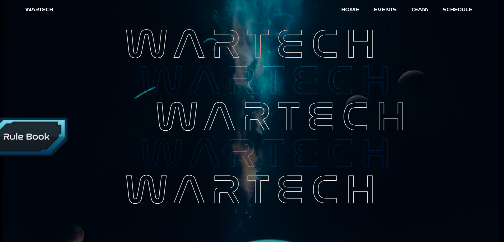
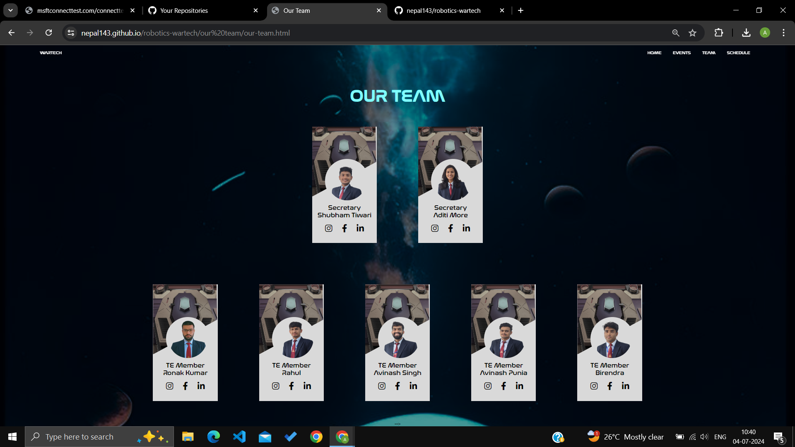
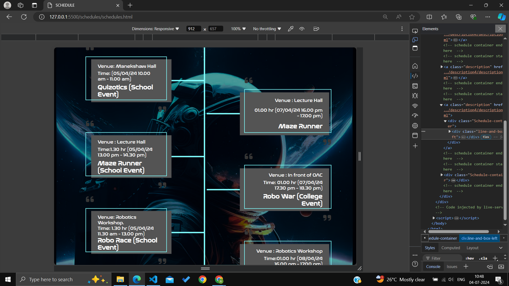

# CEAR - Wartech

## Overview

- **Event:** Wartech - An Event organised by the Center of Excellence for AI and Robotics Club
- **Organizer:** Center of Excellence for AI and Robotics (CEAR)
- **Participants:** Students from various colleges

## Features

- **Website:** Provides event details, registration, and schedule
- **Technologies Used:** HTML, CSS, JavaScript
- **Images and Design:** Figma

## Repository Contents

- **index.html:** Main webpage
- **style.css:** Stylesheet for the website
- **script.js:** JavaScript for interactivity

## Snippets of the Website:

- **Landing Page of the Website:**

- **The Team Section:**
  

- **Responsive Schedule Section:**
  

